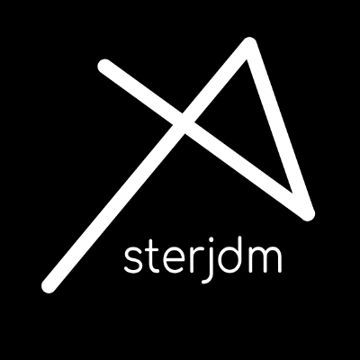
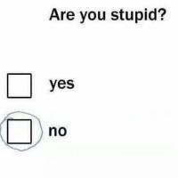

Asteroidus

## Organizations
  

    
 <a src="https://github.com/asterjdm">Asterjdm</a>

    
 <a src="https://github.com/feur-company">Feur-company</a>

  

   
   

   Asterjdm: In this organization we wonder why not better!.
  

  

   Feur-company: This organization is a serious subsidiary (ABSOLUTELY NOT) of asterjdm created to do things useful to society (NO)
   

    <h2>Skills</h2>
    

        
    

    <h2>Whant to learn</h2>
    

        
    

    <h2>Used technologies</h2>
    

        
    

    <h2>Stats</h2>
    

        
    

    

        
    

    

        
    

    

        
    

    

        
    

    

        
    

